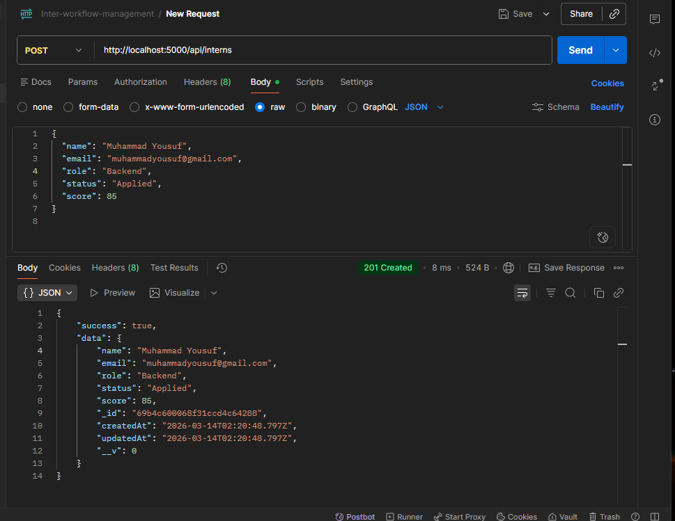
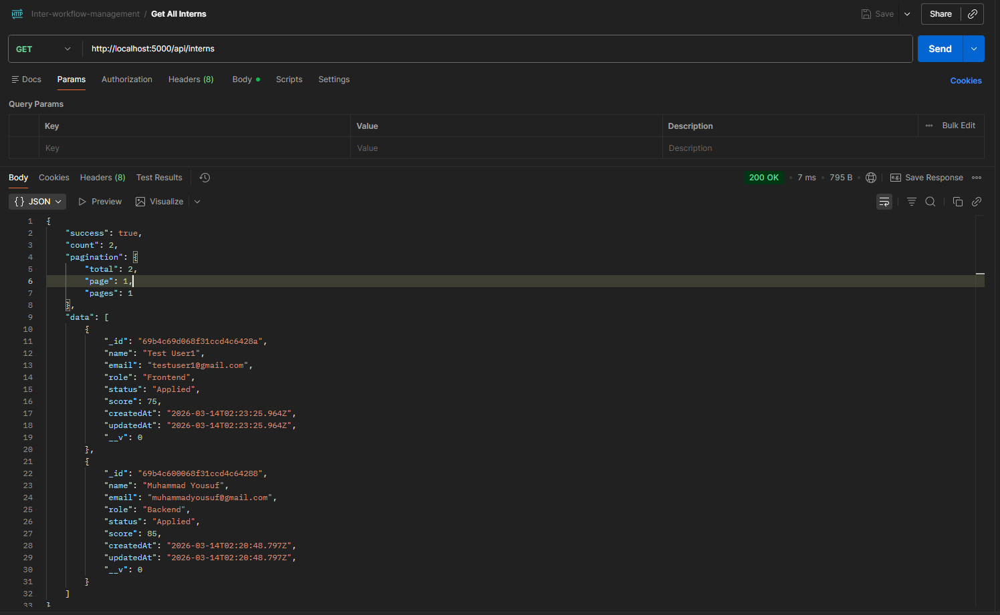
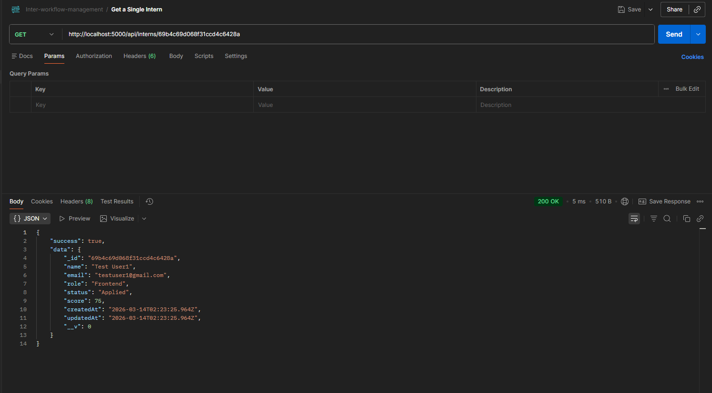
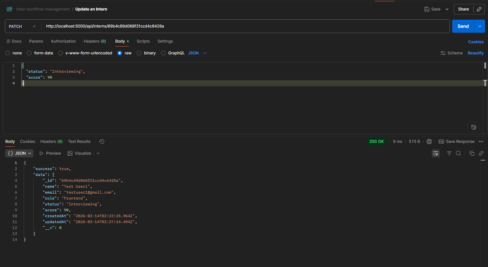
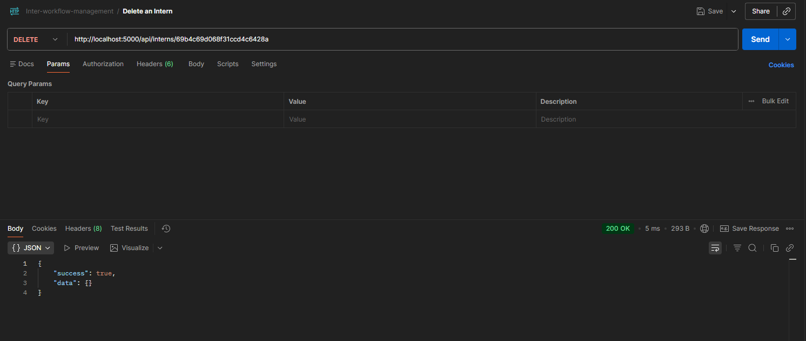
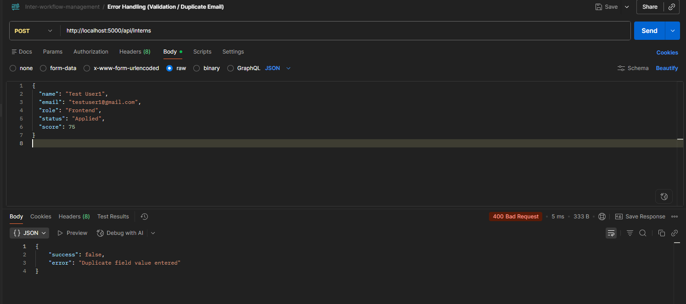

# API Screenshots and Documentation

This document contains the exact API requests you need to test in Postman. After you test each one, take a screenshot of the Postman interface showing the successful response and replace the placeholder URL with the URL of your screenshot.

## Base URL
`http://localhost:5000`

---

### 1. Create a New Intern
**Method:** `POST`  
**Endpoint:** `/api/interns`  
**Headers:** `Content-Type: application/json`  
**Body (JSON):**
```json
{
  "name": "Muhammad Yousuf",
  "email": "muhammadyousuf@gmail.com",
  "role": "Backend",
  "status": "Applied",
  "score": 85
}
```

**Screenshot Placeholder:**  


---

### 2. Get All Interns (with Search, Filter, Pagination)
**Method:** `GET`  
**Endpoint:** `/api/interns?page=1&limit=5&role=Frontend&status=Applied&search=jane`  
*(You can test with or without query parameters)*

**Screenshot Placeholder:**  


---

### 3. Get a Single Intern
**Method:** `GET`  
**Endpoint:** `/api/interns/:id`  
*(Replace `:id` with the `_id` of the intern created in step 1)*

**Screenshot Placeholder:**  


---

### 4. Update an Intern
**Method:** `PATCH`  
**Endpoint:** `/api/interns/:id`  
*(Replace `:id` with the `_id` of your intern)*  
**Headers:** `Content-Type: application/json`  
**Body (JSON):**
```json
{
  "status": "Interviewing",
  "score": 90
}
```

**Screenshot Placeholder:**  


---

### 5. Delete an Intern
**Method:** `DELETE`  
**Endpoint:** `/api/interns/:id`  
*(Replace `:id` with the `_id` of your intern)*

**Screenshot Placeholder:**  


---

### 6. Error Handling (Validation / Duplicate Email)
**Method:** `POST`  
**Endpoint:** `/api/interns`  
**Headers:** `Content-Type: application/json`  
**Body (JSON):**
```json
{
  "name": "Test User1",
  "email": "testuser1@gmail.com",
  "role": "Frontend",
  "status": "Applied",
  "score": 75
}
```
*(Demonstrates validation errors. To show duplicate email error, submit the exact same valid payload from step 1 twice.)*

**Screenshot Placeholder:**  

